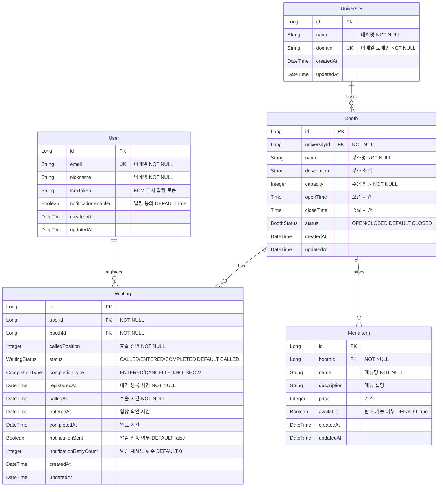

# Festin - Database Schema

## 📌 개요

### 데이터베이스 구성
- **MySQL**: 영구 저장 (호출 이력, 부스 정보, 사용자 정보)
- **Redis**: 대기열 관리 (임시 데이터)

### 설계 원칙
- **정규화**: 3NF 준수
- **인덱싱**: 주요 조회 컬럼에 인덱스 설정
- **제약조건**: FK, UK, NOT NULL로 데이터 무결성 보장

---

## 🗂️ ERD


---

## 📋 테이블 상세

### 1. University (대학)
**목적**: 축제를 주최하는 대학 정보

| 컬럼 | 타입 | 제약 | 설명 |
|------|------|------|------|
| id | BIGINT | PK | 대학 고유 ID |
| name | VARCHAR(100) | NOT NULL | 대학명 |
| domain | VARCHAR(100) | UK, NOT NULL | 이메일 도메인 (예: snu.ac.kr) |
| created_at | TIMESTAMP | - | 생성 시각 |
| updated_at | TIMESTAMP | - | 수정 시각 |

---

### 2. User (사용자)
**목적**: 축제 방문자 정보 및 알림 설정

| 컬럼 | 타입 | 제약 | 설명 |
|------|------|------|------|
| id | BIGINT | PK | 사용자 고유 ID |
| email | VARCHAR(255) | UK, NOT NULL | 이메일 (로그인 ID) |
| nickname | VARCHAR(50) | NOT NULL | 닉네임 |
| fcm_token | VARCHAR(255) | NULL | FCM 푸시 알림 토큰 |
| notification_enabled | BOOLEAN | DEFAULT true | 알림 동의 |
| created_at | TIMESTAMP | - | 생성 시각 |
| updated_at | TIMESTAMP | - | 수정 시각 |

---

### 3. Booth (부스)
**목적**: 축제 부스 정보 및 운영 시간

| 컬럼 | 타입 | 제약 | 설명 |
|------|------|------|------|
| id | BIGINT | PK | 부스 고유 ID |
| university_id | BIGINT | FK, NOT NULL | 대학 ID |
| name | VARCHAR(100) | NOT NULL | 부스명 |
| description | TEXT | NULL | 부스 소개 |
| capacity | INT | NOT NULL | 최대 수용 인원 |
| open_time | TIME | NULL | 오픈 시간 |
| close_time | TIME | NULL | 종료 시간 |
| status | VARCHAR(20) | DEFAULT 'CLOSED' | OPEN/CLOSED |
| created_at | TIMESTAMP | - | 생성 시각 |
| updated_at | TIMESTAMP | - | 수정 시각 |

**Enum**:
```java
enum BoothStatus {
    OPEN,    // 운영 중
    CLOSED   // 운영 종료
}
```

---

### 4. MenuItem (메뉴)
**목적**: 부스에서 제공하는 메뉴 정보

| 컬럼 | 타입 | 제약 | 설명 |
|------|------|------|------|
| id | BIGINT | PK | 메뉴 고유 ID |
| booth_id | BIGINT | FK, NOT NULL | 부스 ID |
| name | VARCHAR(100) | NOT NULL | 메뉴명 |
| description | TEXT | NULL | 메뉴 설명 |
| price | INT | NULL | 가격 (원) |
| available | BOOLEAN | DEFAULT true | 판매 가능 여부 |
| created_at | TIMESTAMP | - | 생성 시각 |
| updated_at | TIMESTAMP | - | 수정 시각 |

---

### 5. Waiting (대기 이력)
**목적**: 호출 이후 대기 이력 저장

| 컬럼 | 타입 | 제약 | 설명 |
|------|------|------|------|
| id | BIGINT | PK | 대기 이력 고유 ID |
| user_id | BIGINT | FK, NOT NULL | 사용자 ID |
| booth_id | BIGINT | FK, NOT NULL | 부스 ID |
| called_position | INT | NOT NULL | 호출 순번 |
| status | VARCHAR(20) | DEFAULT 'CALLED' | 현재 상태 |
| completion_type | VARCHAR(20) | NULL | 완료 사유 |
| registered_at | TIMESTAMP | NOT NULL | 대기 등록 시간 |
| called_at | TIMESTAMP | NOT NULL | 호출 시간 |
| entered_at | TIMESTAMP | NULL | 입장 확인 시간 |
| completed_at | TIMESTAMP | NULL | 완료 시간 |
| notification_sent | BOOLEAN | DEFAULT false | 알림 전송 여부 |
| notification_retry_count | INT | DEFAULT 0 | 알림 재시도 횟수 |
| created_at | TIMESTAMP | - | 생성 시각 |
| updated_at | TIMESTAMP | - | 수정 시각 |

**Enum**:
```java
enum WaitingStatus {
    CALLED,      // 호출됨
    ENTERED,     // 입장 확인됨
    COMPLETED    // 완료됨
}

enum CompletionType {
    ENTERED,     // 정상 체험 완료
    NO_SHOW,     // 타임아웃 미입장
    CANCELLED    // 사용자 취소
}
```

---

## 📊 Redis 데이터 구조

Redis는 대기열 관리 및 캐싱에 사용됩니다.

**상세 내용**: [redis.md](./redis.md) 참고

---

**Last Updated**: 2025-12-17
**Version**: 2.0